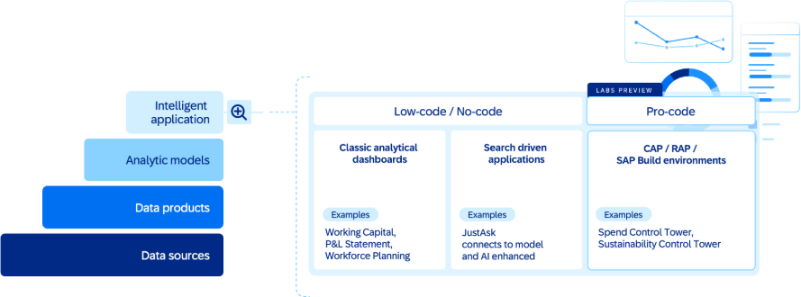
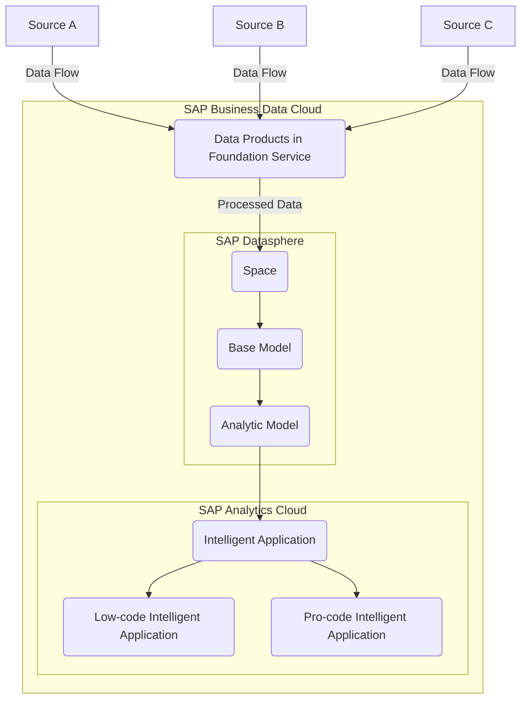

### Overview

Intelligent content is a suite of adaptive, AI-powered applications that learn from your data, understand business context, and act on your behalf.

- It is the next-generation content autonomously delivers insights, makes recommendations, and orchestrates workflows.
- Built on a foundation of certified data products in SAP Business Data Cloud.
- Available across all lines of business, such as finance, supply chain, and HR.

SAP Business Data Cloud provides the trusted data foundation that powers pre-built intelligent content for every line of business. This intelligent content delivers data products, semantic models, analytical models, and dashboards aligned to specific use cases from each line of business (e.g. workforce planning for HCM, working capital for Finance, etc.)

### Intelligent Package and Intelligent Content

An Intelligent package for a given line of business/industry is a set of intelligent content along with all the requisite components. SAP delivers the below list of intelligent packages:

- Cloud ERP Intelligence Private (released 2025)
-People Intelligence (released 2025)
-Finance Intelligence (controlled availability as of January 2026)
-Spend Intelligence
-Supply Chain Intelligence
-Revenue Intelligence
-Travel & Expense Intelligence
-Retail Intelligence
-Consumer Products Intelligence

Intelligent content itself is AI-augmented application(s) that generates continuous learning and contextual experiences relying on a composable architecture leveraging rich data products, domain content, and application components. This can be AI Agents and Intelligent Applications.

No-code Intelligent Content is built in SAP SAC based on Analytics and AI Centric.

Pro-code Intelligent Content SAP managed pro-code application built on SAP BTP that consumes data products and semantic models from one or more Intelligent packages.

### Formation Setup for Intelligent Content

To enable or develop Intelligent Content, SAP Business Data Cloud, SAP Analytics Cloud, and SAP Datasphere must operate in a formation. This involves:

High-Level Object Structure of Intelligent Applications consist of:

- **Visualization Objects**:
    - SAP Analytics Cloud stories serve as dashboards.
    - Interactive elements such as diagrams, tables, and charts.

- **Underlying Models**:
    - SAP Datasphere-based analytic models and views.
    - Automated data replication and transformation services.

**Data Flows**

The following diagram shows how raw source data is enriched as it moved through SAP BDC components until being surfaced in an Intelligent Application.

- Single Sign-On

    - Seamless navigation between tenants of SAP Business Data Cloud, SAP Analytics Cloud, and SAP Datasphere.
    - Enabled via [SAP Cloud Identity Services](https://help.sap.com/docs/cloud-identity-services) and Identity Authentication.

- Live Data Connection

    - SAP-managed live data connections link SAP Datasphere objects to SAP Analytics Cloud for Intelligent Applications usage.

- Custom Connections
    - Users can create additional connections to access custom models and Data Products.

### Key Components of Intelligent Applications

| **Component**            | **Description**                                                                  |
| ------------------------ | -------------------------------------------------------------------------------- |
| **Visualization Object** | SAP Analytics Cloud story for dashboards and reports. AI Agents.  
| **Analytic Models**      | SAP Datasphere models that prepare and expose data for visualization.            |
| **Data Products**        | Data sets integrated into the analytic models, derived from Foundation Services. |
| **Foundation Services**  | Backend services for data replication and transformation.                        |
| **Roles**                | Scoped roles generated for access to relevant spaces.                            |

#### Workflow of Intelligent Applications Development

**1. Installation of Data Package/Product and Intelligent Content**

Search and Install

    - Log in to SAP Business Data Cloud cockpit.
    - Browse available Intelligent Applications and their associated documentation.

Automated Setup

    - Installation generates SAP-managed objects, including:
        - Associated Data Products.
        - Replication flows, tables, views, and analytic models in SAP Datasphere.
        - Scoped roles for the relevant spaces.

**2. Dashboard Creation**
A dashboard is deployed as an SAP Analytics Cloud story for visualization.

**3. Visualization**

-   Intelligent Applications provide interactive dashboards based on live data connections to SAP Datasphere.
-   Users can apply filters, select members or dimensions, and set variable values (e.g., target currency).

### Customization and Enhancement

**Copying Content**

-   SAP-managed Intelligent Applications and their dependencies cannot be directly edited but components can be copied and adapted, as needed.
-   Users can copy SAP Analytics Cloud stories to enhance or adjust them for their needs.

**Enhancing Models**

-   For advanced use cases, users can copy and modify the underlying analytic models.
-   Changes to models affect both original and copied stories.

### Conclusion

Intelligent Content simplify the visualization and analysis of data in SAP Business Data Cloud. By leveraging SAP Analytics Cloud for dashboards and SAP Datasphere for data preparation, Intelligent Applications offer pre-configured, SAP-managed solutions that reduce complexity and enhance usability. Their architecture integrates Data Products, Foundation Services, and analytic models, ensuring seamless deployment and scalability while allowing customization for advanced scenarios.