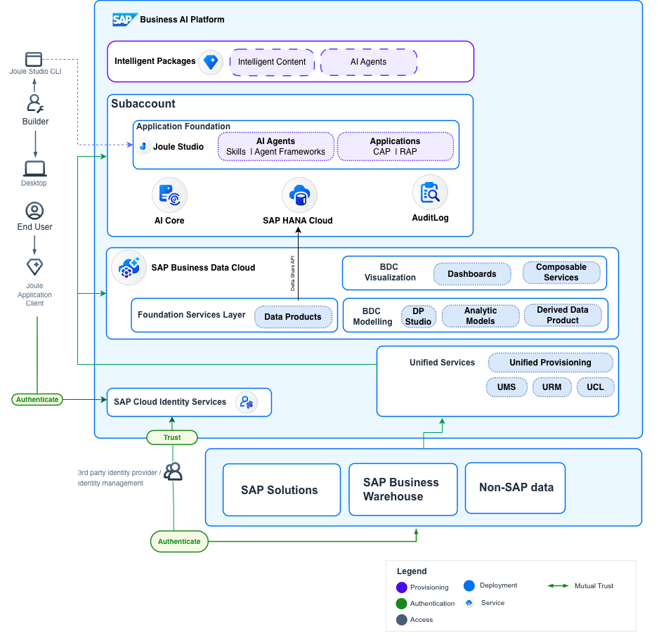

### Introduction

Intelligent Content represent a distinct use case from the broader Intelligent Applications context. They contain an SAP managed collection of analytical assets and functionalities to provide value to customers through analytical, process, or domain insights. It can contain data products, semantic models, stories, planning models, AI-powered analytics, and more.

### Reference Architecture of Intelligent Content

Intelligent content can be classic analytical dashboards(Working Capital,Workforce Planning), Search-driven applications(Joule) and CAP/RAP Applications(Spend Control Tower).

**Definition**

Intelligent content based on SAP BTP Application built using the SAP BTP Guidance Framework. It is SAP-managed multi-tenant Saas application built using SAP BTP CAP or ABAP Cloud and SAP HANA Cloud. It can consume Data Products and can also produce Data Products. These are commercialized through BDC Intelligent Package SKU. Stand-alone apps can consume data products via App2App integration scenario via embedded FOS. All applications are built using CAP-Jana or CAP-JS on SAP BTP.

**Data Product Foundation:**
Data Product represents curated dataset available for consumption in intelligent applications.These can be authored in the unified Data Product Studio. A comprehensive description of the data products together with their schema, dependencies and references are provided using Open Resource Discovery (ORD) and Core Schema Notation (CSN). Both ORD and CSN are open standards developed and open sourced by SAP. The general information about available data products is provided on the Business Acceleration Hub. In the customer landscapes the specific information is collected and aggregated in the Unified Customer Landscape. UCL serves as the main data products repository in these customer landscape. 

SAP BDC Foundation services sources Data Product data from LoB Application, CAP Applications through thier HANA Cloud and also from customer specific data management systems.
SAP BDC provides range of data access and consumption options, initial focus is on Delta Sharing of Data Products.

**UCL Formations:**
UCL Formations are a logical grouping of SAP systems together in one virtual “landscape”.

**Intelligent Content Design Time:**
- Applications are built using SAP Joule Studio using SAP CAP Java on HANA Cloud. They run either on SAP Cloud Foundry/- Kyma runtime.
- The application lifestyle is simplified and will be part of Application Foundation in SAP BTP Fabric.
- SAP CAP will provide tooking to import the metadata of SAP Data Product. With Fabric virtual tables, BDC Foundation services will share the data product to SAP HANA Cloud via Delta Share API exposed by BDC FOS.
- Analytical models are define in CAP CDS by adding analytical annotations. CAP Analytics plugins will be available.

**Intelligent Content Run-time:**
- Tenant mapping between SAP HANA Cloud and BDC FOS is done via UCL.
- Data Product entities in BDC FOS will be available as Fabric Virtual Tables (FVT) in the HANA Cloud tenant of the CAP application.
- CAP will deploy the pre-defined analytical models that are part of the IntApp locally, into the HANA Cloud tenant of the CAP app 
- The Analytical UI elements (SAC stories and/or Composable elements) will connect to the InA API exposed by CAP.

## Installing, Activating, and Visualizing a Standard SAP S/4HANA Data Product

### Installing and Activating a Data Product in SAP Datasphere

Installation involves fully activating associated data products and installing content within SAP Datasphere and SAP Analytics Cloud, enabling direct consumption of dashboards. SAP Datasphere provides robust data warehouse capabilities, advanced data integration tools, and seamless support for both native and derived data products. It simplifies the consumption, management, and publication of data products across the organization.

1. **Review and Install the Data Product:** Evaluate the data product’s summary, sample data, included objects, terms of use, and supporting documentation to ensure it meets analytical requirements. Preview a sample dataset for validation or directly install the data product into a designated SAP Datasphere space for further modeling and analysis.

2. **Activate Data Packages:** Activation makes baseline data and relevant data products of a data package available. Data and models reside within the foundation services, and data products can be discovered and installed via the catalog.

### Visualizing a Data Product in SAP Analytics Cloud (SAC)

For advanced visualization and planning, **SAP Analytics Cloud (SAC)** is the recommended solution for both embedded and standalone analytics scenarios. SAC integrates seamlessly with SAP Datasphere, enabling users to transform data products into actionable insights through interactive dashboards and reports. The embedded (OEM) version of SAC enhances performance with a streamlined viewer and offers cost efficiencies via a shared application tenant.

**Visualization Steps:**

1. **Establish Connectivity:** Ensure SAP Analytics Cloud is connected to the SAP Datasphere environment where the data product resides.
2. **Model the Data:** Consume analytical models in Datasphere based on the deployed data product, leveraging its semantic richness for accurate analysis.
3. **Develop Dashboards:** Design and publish dashboards and reports in SAC to visualize key metrics, trends, and business outcomes.

By following this streamlined approach, organizations can efficiently produce, deploy, and visualize standard SAP S/4HANA data products, unlocking faster, more reliable insights and maximizing the value of their SAP data landscape.

### SAP-Delivered Intelligent Content

SAP-managed data products are installed, and end users utilize the standard Intelligent Applications via SAP Analytics Cloud. Intelligent Applications are pre-built analytical applications within SAP BDC that help uncover hidden insights and enable faster decision-making. These apps are fully managed by SAP, built on curated SAP BDC data products, Datasphere models, and SAC stories, and include predefined metrics, AI models, and planning tools.

**SAP-Managed Data Products:**
- Fully managed by SAP throughout their lifecycle.
- Data is stored within the Foundation Service (FOS) HDLFS, which is not directly accessible to customers.

### Customization of SAP-Delivered Intelligent Content

Organizations can copy and customize the underlying SAP Datasphere analytical models and SAP Analytics Cloud stories, leveraging SAP-managed data products.

## Services and Components

- **SAP BDC Cockpit:** Centralized management interface for SAP BDC.
- **SAP Datasphere:** Centralized data management platform supporting self-service, semantic onboarding, and integration with data marketplaces.
- **SAP Analytics Cloud (SAC):** Provides advanced analytics and visualization capabilities.
- **Data Products:** Standardized datasets for AI/ML and cross-domain analytics. Exposed for consumption outside the producing application via APIs, described by high-quality metadata, and semantically aligned for access through the Data Product Directory.
- **Data Packages:** Logical grouping of data products, used as foundations for modeling in SAP Datasphere or for AI/ML scenarios in SAP Databricks.
- **Intelligent Content:** Pre-built applications for actionable intelligence. Low-code apps composed of data products, data models, and SAC content. SAC content demonstrates the underlying data products to fulfill specific analytics use cases. Customers can extend the analytical layer to meet specific requirements.

## Examples in an SAP Context

SAP will publish Intelligent Applications across all application pillars, such as Core Enterprise Analytics, People Analytics, Spend Analytics, Customer Analytics, Supply Chain Analytics, and Partner Ecosystem Apps.

:::info Note
Not all examples listed below are generally available (GA) at this time.
:::

- **Core Enterprise Analytics:** Enables companies to optimize current assets and maintain sufficient cash flow for short-term goals and obligations. Intelligent Applications provide details on trends like working capital over past periods and average payment periods for accounts payable. Examples: Working Capital, Sales Analysis.
- **People Analytics:** Helps customers understand their workforce composition and organizational structure. Examples: Employee Central, Learning.
- **Spend Analytics:** Provides a comprehensive overview of spend across multiple applications, uncovering hidden linkages between suppliers. Examples: Spend Control Tower, Procurement Analysis.

## Resources

[SAP Business Data Cloud - FAQ](https://community.sap.com/t5/technology-blogs-by-sap/sap-business-data-cloud-faqs/ba-p/14022781)

## Conclusion

Using SAP's pre-built data products and Intelligent Content provides a comprehensive view of critical business processes across all SAP applications. This ensures consistency and business context with SAP-managed data sets and semantics. Adopting SAP data products offers comprehensive lifecycle management, eliminating the overhead of building a trusted data foundation.